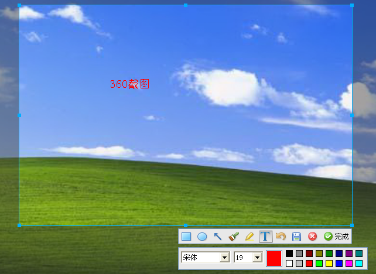

# 360SceenCapture

##### 说明

360做的截图软件，没有启动参数，程序直接退出，不给截图。

于是给360的截图软件套了成皮，双击就可以实现截图。

截取的图片默认保持在桌面。360ScreenCapture.exe的版权归360所有。

##### 360ScreenCapture.exe
此程序提取自360安全卫士安装包，未做任何修改

##### Release

下载[Loader360SceenCapture.exe](./Bin/Loader360SceenCapture.exe)

勿非法使用，侵权删除

##### 程序图标作者网站

https://www.easyicon.net/1200392-screen_icon.html

#####  Windows下截图软件的原理

参考：[Screenshot](https://github.com/wanttobeno/Screenshot)